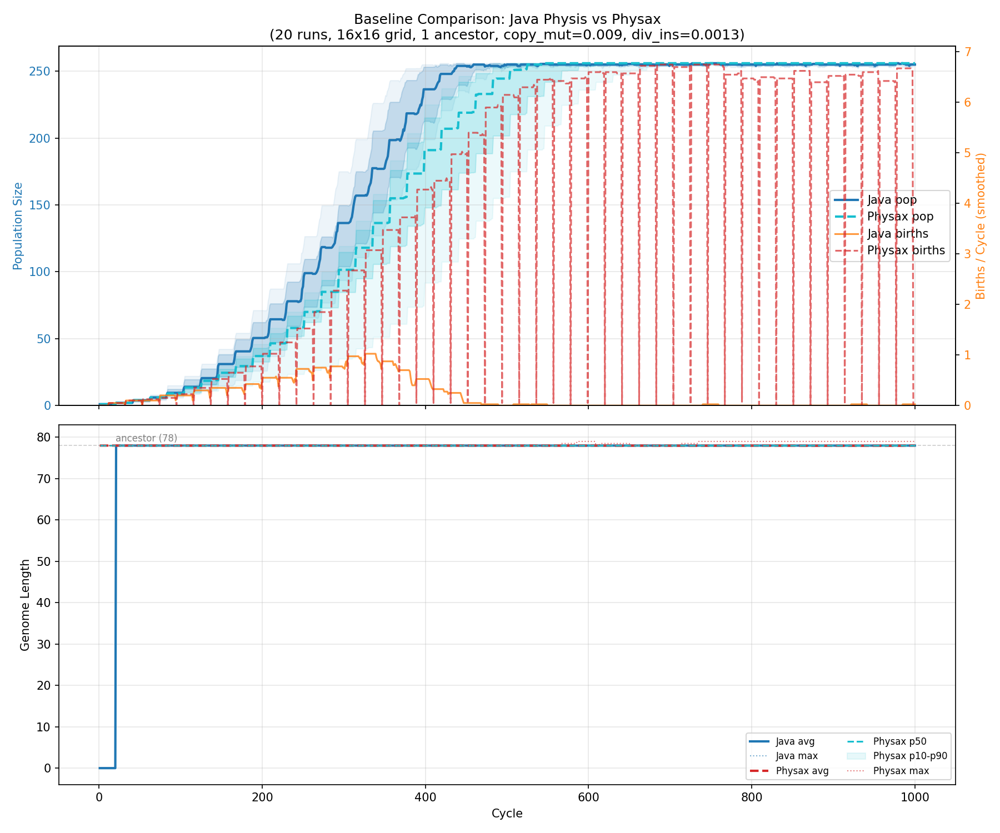
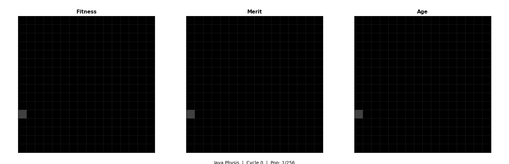
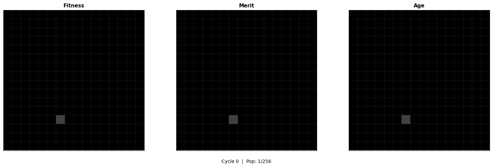

# Physax: Physis JAX

Physax is a GPU-accelerated digital evolution simulator built with [JAX](https://github.com/google/jax). It is a faithful port of the original Java [Physis](https://codeberg.org/egri-nagy/physis) system, simulating self-replicating digital organisms whose genomes encode both the instruction set (language) and the program (code) -- a "dynamic phenotype" where evolution can modify both the program and the hardware it runs on.

Physax is built upon the theoretical framework of self-replicating digital organisms in Tierra-like systems. The core research objectives -- exploring the evolvability of the genotype-phenotype relation -- are detailed in the following paper:

> Attila Egri-Nagy and Chrystopher L. Nehaniv. *Evolvability of the Genotype-Phenotype Relation in Populations of Self-Replicating Digital Organisms in a Tierra-Like System.* In Wolfgang Banzhaf, Jens Ziegler, Thomas Christaller, Peter Dittrich, and Jan T. Kim, editors, Advances in Artificial Life, pages 238-247. Springer, 2003. DOI: [10.1007/978-3-540-39432-7_26](https://doi.org/10.1007/978-3-540-39432-7_26)

## Behavioral Verification

Physax has been verified against the original Java Physis to produce statistically equivalent behavior. The experiment runs 20 independent simulations (different random seeds) on a 16x16 toroidal grid with 1 ancestor organism for 1000 cycles each.

### Results (20 runs, 16x16 grid, 1000 cycles)

| Metric | Java Physis | Physax |
|---|---|---|
| Final population | 255.2 +/- 0.9 | 243.8 +/- 53.2 |
| Final avg genome length | 78.0 +/- 0.0 | 78.1 +/- 0.3 |
| Grid saturation | ~cycle 500 | ~cycle 600 |

Both systems show the same qualitative dynamics: logistic population growth from a single ancestor, stable genome lengths around the ancestral 78 genes, and grid saturation.

### Comparison Plot



**Top:** Population size and births per cycle (mean +/- std over 20 runs). **Bottom:** Average genome length with min/max/percentile bands.

### Simulation GIFs

| Java Physis | Physax |
|---|---|
|  |  |

16x16 toroidal grid, 1000 cycles. Colors represent species lineage (offspring inherit parent color with slight HSV drift on mutation).

## Architecture

The entire simulation lives in a single file: **`physax.py`** (~700 lines), organized into sections:

1. **Constants** -- ARCHE instruction set (44 opcodes) with operand counts
2. **Configuration** -- Simulation parameters (mutation rates, scheduler, allocation limits)
3. **Organism State** -- JAX array-based state: genome, structural elements, instruction table, child tape
4. **Genome Parsing** -- `build_structure()` and `build_instruction_set()` extract phenotype from genome
5. **VM Execution** -- `vm_execute_one()` executes compound instructions with unified parent/child address space
6. **Mutation** -- Copy mutation on child writes (0.009), divide insertion/deletion (0.0013)
7. **Population Init** -- Seed with the 78-gene `arche.replicator` ancestor
8. **Cycle Step** -- Execute all organisms, handle births with OldestNurse spatial placement
9. **Visualization** -- Metrics plots and animated GIF generation
10. **Main Simulation** -- JIT-compiled `lax.scan` chunks with optional W&B logging

### Key Design Choices

- **Faithful to original Physis**: VM semantics, instruction encoding, mutation model, and spatial reproduction all match the Java implementation
- **Pure JAX**: All simulation logic is JIT-compilable; population-level parallelism via `jax.vmap`
- **Fixed-size arrays**: Padded arrays with length tracking (required by JAX's static shape constraint)
- **Struct-of-arrays**: Population state stored as dict of `(pop_size, ...)` shaped arrays

## Quick Start

```bash
pip install -r requirements.txt

# Full simulation (256 organisms, 2000 cycles)
python physax.py

# Debug single organism replication (prints VM state each step)
python debug_repro.py

# Verify population dynamics on a small grid
python verify_sim.py

# Run baseline comparison experiment (requires Java Physis in physis/ directory)
python run_experiment.py
```

## Working Replicator Genomes

[genomes.md](genomes.md) provides working replicator genomes to seed the simulation.

## Original Implementation

[egri-nagy/physis](https://codeberg.org/egri-nagy/physis) -- the original Java implementation by Attila Egri-Nagy.
